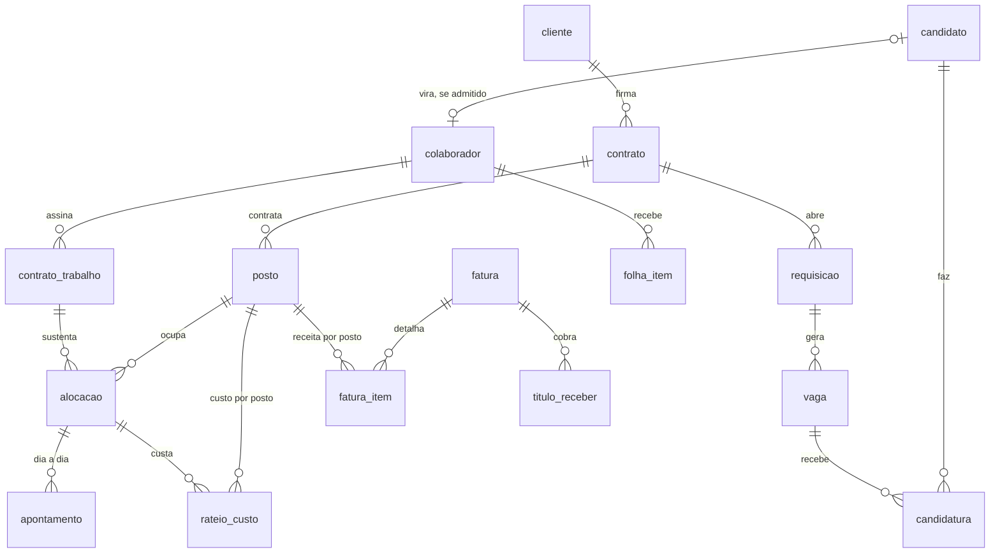

<a id="topo"></a>

# Modelo de Dados · a réplica do sistema do cliente

<!-- nav:start -->
[Home](../README.md) | [← Arquitetura](03_arquitetura.md) | [Segurança e LGPD →](05_seguranca_e_lgpd.md)
<!-- nav:end -->

> O banco relacional de onde o pipeline lê: 10 módulos, 75 tabelas de negócio e uma de infraestrutura, em MySQL 8, com comentário em toda tabela e etiqueta LGPD em toda coluna de dado pessoal. A DDL está em [`staging/ddl`](../staging/ddl), um arquivo por módulo, na ordem das dependências. Este documento explica as convenções, o papel de cada módulo e as decisões de desenho; o dicionário coluna a coluna, gerado do próprio banco, entra na v0.2.0 (card 2.7).

## 1. O que este banco é, e o que não é

É a **réplica autorizada** do sistema da Fictalent, em ambiente apartado (a decisão está no [ADR-0001](adr/0001-mysql-no-staging-postgres-no-olap.md) e o mapa de escopo na [Arquitetura, seção 3](03_arquitetura.md#3-por-que-o-staging-é-uma-réplica-e-o-que-ela-representa)). Modela o que uma empresa de gestão de mão de obra **deveria ter** num sistema só: o funil comercial, o funil de colocação, o vínculo CLT, o ponto, a folha, o financeiro, os treinamentos e a SST, com as três decisões que atravessam tudo ([Entendimento dos Dados](02_entendimento_dados.md)): candidato e colaborador são coisas diferentes; o **posto** é a unidade de receita; **vigência** no lugar de estado.

Não é um banco analítico: é normalizado, transacional, com as chaves e regras que um sistema de verdade teria. O contraste com o star schema do warehouse é parte do que o projeto ensina.

## 2. Convenções que valem para as 76 tabelas

| convenção | como | por quê |
|---|---|---|
| chave primária | `id BIGINT UNSIGNED AUTO_INCREMENT` em toda tabela | relacionamento sempre por `id`; a chave natural (CPF, matrícula, número) existe e tem índice único, mas não é a chave |
| carimbos | `criado_em` e `atualizado_em` em `DATETIME(6)`, UTC, mantidos pelo próprio motor (`ON UPDATE CURRENT_TIMESTAMP`) | `atualizado_em` é a **marca d'água** da carga incremental; o relógio do servidor é fixado em UTC no compose |
| índice na marca d'água | `ix_<tabela>_atualizado_em` em toda tabela de negócio | a carga incremental pergunta "o que mudou desde X" em 75 tabelas todo dia; sem índice, isso é varredura completa |
| vigência | `vigencia_inicio` e `vigencia_fim`, `NULL` = vigente | permite reconstruir a foto de qualquer dia sem coluna de status |
| competência | `DATE` no primeiro dia do mês | folha, provisão, fatura, rateio e consolidado falam a mesma língua |
| domínios fechados | `CHECK (coluna IN (...))`, nunca `ENUM` | `ENUM` é extensão do MySQL, difícil de evoluir e invisível para quem lê o dicionário; o `CHECK` é padrão SQL e o motor o aplica desde a 8.0.16 |
| dinheiro e percentual | `DECIMAL(14,2)` e `DECIMAL(7,4)` | nunca ponto flutuante em valor |
| chaves estrangeiras | declaradas em toda coluna `_id`, inclusive entre databases | o InnoDB aceita FK entre databases da mesma instância; os dois ciclos (`centro_custo` ↔ `contrato`, `entrevista` → `usuario`) fecham com `ALTER` guardado por `information_schema`, idempotente |
| exclusão | nenhuma FK com `ON DELETE CASCADE`; gatilho `BEFORE DELETE` em toda tabela de negócio | o `DELETE` é um evento que a trilha de exclusões precisa ver (seção 6), não um efeito em cadeia |
| comentário | `COMMENT` em toda tabela e nas colunas que precisam de explicação | o dicionário de dados é gerado da `information_schema`, não escrito à mão |
| etiqueta LGPD | `[LGPD:pessoal]` ou `[LGPD:sensivel]` no comentário da coluna; `[LGPD:publica]` no comentário das tabelas de referência | classificação por coluna nasce no banco; o DCL, a pseudonimização da silver e o [dicionário de dados](dicionario/README.md) leem daqui |
| databases | um por módulo, com o nome do módulo | em MySQL, *schema* e *database* são a mesma coisa |
| cifra em repouso | `ENCRYPTION='Y'` em toda tabela e `DEFAULT ENCRYPTION='Y'` em todo database | o disco, o volume e o dump não expõem dado pessoal em claro (seção 8) |

Um teste estático (`tests/test_ddl.py`) confere as convenções em cada arquivo sem precisar de banco; outro (`tests/test_ddl_aplicada.py`) confere a réplica de verdade quando ela está de pé, inclusive apagando uma linha para ver o rastro aparecer na trilha.

## 3. Os módulos

| módulo | tabelas | o que guarda | a tabela que importa |
|---|---|---|---|
| `cadastro` | 12 | filiais, municípios, endereços, funções, convenções e pisos, feriados, escalas, motivos, parâmetros, centros de custo | `piso_salarial`: a base do custo por cabeça, com vigência |
| `comercial` | 8 | clientes e contatos, contratos e aditivos, postos e preços, SLAs, ocorrências | `posto`: o cliente contrata postos, não pessoas |
| `ats` | 9 | requisições, vagas, candidatos e experiências, fontes, etapas, candidaturas e suas passagens, entrevistas | `candidatura_etapa`: cada passagem com data, de onde saem conversão e tempo por etapa |
| `pessoas` | 8 | colaboradores, documentos, dependentes, contratos de trabalho e prorrogações, alocações, afastamentos, desligamentos | `alocacao`: headcount, ocupação, dias descobertos e custo por contrato saem dela |
| `ponto` | 5 | escala por pessoa, marcações brutas, apontamento do dia, ocorrências, banco de horas | `marcacao`: 4 batidas por dia, o registro bruto do relógio; a maior tabela do banco |
| `folha` | 7 | eventos, benefícios, competências, itens, provisões, benefícios por pessoa, rateio de custo | `rateio_custo`: leva o custo de cada pessoa até o posto onde ela trabalhou |
| `financeiro` | 10 | regime e tributos, alíquotas por município, fornecedores, faturas e itens, títulos a receber e a pagar, impostos apurados, consolidado gerencial | `consolidado_gerencial`: a planilha que diverge da operação a partir de 2022 |
| `treinamento` | 5 | cursos, exigência por função, turmas, participantes, certificados | `certificado`: o documento com prazo, que vira alerta |
| `sst` | 6 | tipos de exame, ASOs, programas legais, riscos por posto, acidentes, CATs | `aso`: ASO vencido com pessoa alocada é o alerta mais caro do painel |
| `seguranca` | 5 | usuários, perfis, escopo por filial, matriz de permissão, log de auditoria | `usuario_perfil`: a assistente vê a filial dela, a coordenadora vê o setor |
| `meta` | 1 | trilha de exclusões | `exclusao_auditoria`: o `DELETE` que a marca d'água não veria |

A finalidade de cada tabela está no `COMMENT` dela, dentro da DDL, e o [dicionário de dados](dicionario/README.md), gerado da `information_schema`, traz coluna a coluna (tipo, nulo, chave, padrão, classe LGPD e descrição), aberto pelo inventário de dado pessoal. Para ler direto do banco:

```sql
SELECT table_schema, table_name, table_comment
  FROM information_schema.tables
 WHERE table_schema IN ('cadastro','comercial','ats','pessoas','ponto','folha','financeiro','treinamento','sst','seguranca','meta')
 ORDER BY 1, 2;
```

## 4. O espinhaço: de onde vem a margem por cliente

As 76 tabelas orbitam uma cadeia curta. O cliente firma um contrato, o contrato contrata postos, a requisição abre vagas, a candidatura aprovada vira colaborador, o colaborador é alocado num posto, o apontamento do dia vira item de folha, a folha é rateada até o posto, e o posto é medido na fatura. Receita e custo se encontram no posto.



O diagrama completo, módulo a módulo, entra com o dicionário de dados (card 2.9).

## 5. Como a DDL é aplicada e conferida

**Na primeira subida** a DDL roda sozinha: o compose monta `staging/ddl` em `/docker-entrypoint-initdb.d`, e o MySQL executa os arquivos em ordem ao criar o volume. Nada a fazer.

**Num volume que já existia** antes da DDL entrar no repositório, ou depois de uma mudança na DDL:

```bash
bash scripts/aplicar_ddl.sh
```

O script aplica os arquivos em ordem e imprime a contagem de tabelas por módulo. Pode rodar quantas vezes quiser: tudo é `IF NOT EXISTS` e os dois `ALTER` de ciclo conferem a `information_schema` antes de agir. Um limite honesto: `CREATE TABLE IF NOT EXISTS` não altera tabela que já existe, então mudança de coluna ou de comentário num volume antigo pede `ALTER TABLE` (ou recomeçar do zero enquanto a réplica não tem dado, como neste estágio).

**Conferir** que a réplica está como a DDL descreve:

```bash
.venv/bin/pytest -q tests/test_ddl_aplicada.py
```

Resultado esperado: os testes passam (contagem por módulo, `id` e carimbos em toda tabela, comentário em toda tabela, índice na marca d'água nas 75 de negócio, mais de 120 chaves estrangeiras e 50 regras `CHECK`, os dois ciclos fechados, etiquetas LGPD presentes, relógio em UTC). Se a réplica não estiver de pé, os testes são pulados, não falham.

## 6. A trilha de exclusões

A marca d'água encontra o que foi criado ou alterado; **não encontra o que foi apagado**, porque a linha apagada não tem mais `atualizado_em` para ser lida. Por isso toda tabela de negócio tem um gatilho `BEFORE DELETE` que grava em `meta.exclusao_auditoria` o database, a tabela, o `id` e o usuário de banco, antes de a linha sumir. A carga incremental lê essa trilha e aplica a exclusão na bronze como marcação lógica (`fl_excluido` com a data), nunca como apagamento físico.

Os 75 gatilhos são **gerados a partir da própria DDL** por `src/rh_fictalent/staging/gatilhos.py` e versionados em [`staging/ddl/12_gatilhos_exclusao.sql`](../staging/ddl/12_gatilhos_exclusao.sql). Um teste falha se o arquivo estiver diferente do que o gerador produz: uma tabela nova sem gatilho não passa na esteira. Para regenerar depois de mudar a DDL:

```bash
.venv/bin/python -m rh_fictalent.staging.gatilhos
```

O gatilho corre na mesma transação do `DELETE`: uma exclusão barrada por chave estrangeira é desfeita junto com o rastro, então a trilha nunca registra o que não aconteceu. A tabela `meta` não tem gatilho: a trilha não vigia a si mesma. Quem apagou é `USER()`, o usuário que executou o `DELETE`; `CURRENT_USER()` dentro de um gatilho devolveria o definidor, e o rastro diria sempre `root`. Cada gatilho é escrito como `DROP TRIGGER IF EXISTS` seguido de `CREATE`, então reaplicar a DDL troca o gatilho pelo da versão atual sem passo manual.

Conferir na réplica que os 75 existem:

```sql
SELECT trigger_schema, COUNT(*)
  FROM information_schema.triggers
 WHERE event_manipulation = 'DELETE' AND action_timing = 'BEFORE'
 GROUP BY trigger_schema;
```

Ver o que foi apagado hoje:

```sql
SELECT banco, tabela, registro_id, dt_exclusao, usuario_banco
  FROM meta.exclusao_auditoria
 WHERE dt_exclusao >= CURRENT_DATE
 ORDER BY dt_exclusao;
```

**Limite honesto.** Neste ambiente o gerador escreve direto na réplica, e o gatilho vê cada `DELETE`. Numa replicação real por binlog em formato de linha, os gatilhos da réplica **não disparam** para eventos replicados; nesse cenário a trilha vem do próprio binlog. A escolha entre as duas fontes é medida e registrada em ADR quando a ingestão for construída (v0.5.0).

## 7. Quem acessa a réplica, e com que direitos

Os perfis de negócio da Fictalent (sócio, gerente, coordenação, assistente, financeiro, TI) são do **sistema do cliente**, que os aplica pela própria matriz `seguranca.permissao`; no warehouse eles voltam como papéis de leitura com isolamento por filial (v0.7.0). Na réplica, quem conecta são **três funções técnicas**, e cada uma tem um papel de banco com o mínimo que a função exige:

| usuário | papel | pode | não pode | quem é |
|---|---|---|---|---|
| `pipeline` | `papel_pipeline` | `SELECT` nos 10 módulos e em `meta` | escrever, criar, apagar, conceder | o pipeline da Neviah (backfill, incremental, trilha de exclusões) |
| `relatorios_cliente` | `papel_relatorios` | `SELECT` nas colunas **sem etiqueta LGPD**; tabelas sem dado pessoal inteiras | ler `cpf`, `nome`, `cid_grupo`, `resultado` do ASO...; `SELECT *` numa tabela com coluna etiquetada; ler `meta`; escrever | os relatórios do próprio sistema do cliente, apontados para a réplica para poupar o produtivo |
| `replicador` | `papel_replicador` | `SELECT`, `INSERT`, `UPDATE`, `DELETE` nos 10 módulos | DDL, `GRANT`, criar usuário, tocar em `meta` | a replicação que chega do cliente; neste projeto, o gerador |

Os papéis e os `GRANT` estão em [`staging/ddl/13_papeis.sql`](../staging/ddl/13_papeis.sql), **gerado da DDL** por `src/rh_fictalent/staging/papeis.py`: para cada tabela com coluna etiquetada `[LGPD:...]`, o `GRANT` do `relatorios_cliente` é coluna a coluna, deixando as etiquetadas de fora. Uma coluna nova etiquetada fica fora do relatório sem ninguém precisar lembrar; uma coluna nova sem etiqueta entra. Regenerar: `.venv/bin/python -m rh_fictalent.staging.papeis`. Os usuários, com senha do `.env`, vêm de [`14_usuarios.sh`](../staging/ddl/14_usuarios.sh), que roda na primeira inicialização e em `scripts/aplicar_ddl.sh` (a senha desses três acompanha o `.env` a cada aplicação; a do root não).

O `DELETE` do `replicador` dispara o gatilho da trilha, que grava em `meta` **com o direito do definidor do gatilho**, não do `replicador`: ele escreve na trilha sem poder lê-la nem apagá-la.

**Os testes passam quando o acesso indevido falha.** `tests/test_dcl_aplicada.py` conecta como cada usuário e confere as duas colunas da tabela acima: o que pode, executa; o que não pode, recebe erro de permissão do MySQL (1044, 1142, 1143 ou 1227). Rodar:

```bash
.venv/bin/pytest -q tests/test_dcl_aplicada.py
```

Conferir os papéis direto no banco:

```sql
SHOW GRANTS FOR 'relatorios_cliente'@'%' USING papel_relatorios;
```

**Uma consequência prática.** Com `GRANT` de coluna, `SELECT *` não passa em tabela com dado pessoal: o relatório precisa nomear as colunas. É desconforto de propósito: é o dado pessoal deixando de vazar por preguiça de digitar.

## 8. Cifra em repouso

**O que ela protege, e o que não protege.** A cifra em repouso protege o **disco**: um volume copiado, um backup extraviado, um arquivo `.ibd` lido fora do servidor. Ela não protege contra um usuário do banco com `SELECT`, porque o servidor decifra para quem tem direito de ler; disso cuidam o controle de acesso (seção 7) e a pseudonimização na silver. As duas camadas se completam, e nenhuma substitui a outra.

**Como está feita.** Toda tabela nasce com `ENCRYPTION='Y'` e todo database com `DEFAULT ENCRYPTION='Y'` (está na DDL, não numa configuração escondida); o servidor sobe com `default_table_encryption=ON` e `table_encryption_privilege_check=ON`, então só quem tem `TABLE_ENCRYPTION_ADMIN` consegue criar tabela em claro. Redo log, undo log e binlog também são cifrados: o dado passa por eles antes de chegar ao tablespace. A chave mestra vive no **keyring** (`component_keyring_file`), carregado por manifesto (`infra/mysql/mysqld.my`) e gravado num volume próprio, `mysql_keyring`, montado em `/var/lib/mysql-keyring`: fora do repositório e fora do diretório de dados, para que um backup do dado não carregue a chave junto. O job `keyring-init` só garante que esse volume pertence ao usuário do MySQL antes de o servidor subir, e o container da réplica roda inteiro como esse usuário (`999`), sem root: foi assim que a chave deixou de nascer com dono errado. Para um volume que já existia antes da cifra, `staging/ddl/15_cifra.sql` (gerado por `src/rh_fictalent/staging/cifra.py`) reescreve cada database e tabela cifrados.

**A prova.** `tests/test_cifra_aplicada.py` confere as variáveis do servidor, o componente ativo e o caminho do keyring, os 76 tablespaces com `encryption = 'Y'`, que uma tabela nova nasce cifrada, que a rotação da chave mestra funciona, e a prova que importa: grava um CPF conhecido em `pessoas.colaborador`, força a escrita em disco (`FLUSH TABLES ... FOR EXPORT`) e procura o CPF dentro do `.ibd`: **zero ocorrências**; a mesma busca numa tabela de controle criada em claro encontra o CPF. Rodar:

```bash
.venv/bin/pytest -q tests/test_cifra_aplicada.py
```

**Rotação e backup.** A chave mestra se troca sem parar o servidor e sem reescrever dados:

```sql
ALTER INSTANCE ROTATE INNODB MASTER KEY;
```

O keyring é parte do backup: **sem ele, o dado cifrado é irrecuperável**. O manual de backup (v1.0.0) cobre os dois juntos; até lá, `docker compose down -v` apaga chave e dados ao mesmo tempo, de propósito.

**O custo, medido.** `bash scripts/medir_cifra.sh` escreve e lê 200 mil linhas numa tabela cifrada e numa em claro; os números estão no [ADR-0002](adr/0002-cifra-em-repouso-tablespace.md).

## 9. Decisões que valem a pena explicar

- **`atualizado_em` pelo motor, não por gatilho.** O plano original previa gatilhos; o `ON UPDATE CURRENT_TIMESTAMP` do MySQL faz o mesmo sem código, e o gerador pode sobrescrever o valor quando precisa datar o passado. Gatilho fica só para o que o motor não faz sozinho: registrar o `DELETE`.
- **CPF sem `UNIQUE` em `ats.candidato`, com `UNIQUE` em `pessoas.colaborador`.** O funil recebe duplicados e CPF inválido, como na vida real; a admissão não pode. A diferença entre os dois é medida na auditoria de qualidade.
- **`ponto.marcacao` sem chave única.** Batida duplicada é sujeira de origem e precisa poder existir para ser detectada e tratada na silver.
- **Nenhum `ON DELETE CASCADE`.** Cada exclusão é um evento que a trilha precisa ver individualmente.
- **Cifra de tablespace, não de coluna.** Cifrar a coluna do CPF com `AES_ENCRYPT` exigiria a chave em cada consumidor e destruiria o índice único; a cifra de tablespace protege o disco de todas as 76 tabelas de uma vez, é transparente para pipeline e relatórios, e deixa o acesso por usuário com o DCL, que é o lugar dele ([ADR-0002](adr/0002-cifra-em-repouso-tablespace.md)).
- **Direitos derivados das etiquetas.** A classificação LGPD nasce no comentário da coluna e o `GRANT` do relatório é gerado dela: classificar e proteger viram o mesmo gesto.
- **Gatilhos gerados, não escritos.** Setenta e cinco blocos iguais escritos à mão são setenta e cinco chances de esquecer um; gerar da DDL e testar a igualdade transforma o esquecimento em falha de esteira.
- **A marca d'água não mora aqui.** A réplica é do cliente; o estado da carga (até onde o pipeline leu cada tabela) é do pipeline e fica no lake.

## 10. O dicionário de dados

O [dicionário](dicionario/README.md) é gerado da `information_schema` da réplica por `src/rh_fictalent/staging/dicionario.py`: o banco descrevendo a si mesmo, sem uma linha escrita à mão. Regenerar depois de mudar a DDL, com a réplica de pé:

```bash
.venv/bin/python -m rh_fictalent.staging.dicionario
```

Um teste de integração falha se o arquivo versionado divergir do que a réplica produz, e um estático confere que toda etiqueta LGPD da DDL aparece no inventário e que nenhum comentário acentuado virou lixo (o cliente `mysql` do container escolhe o charset pela `LANG`; sem ela, a DDL em UTF-8 é gravada como latin1, e foi o dicionário que denunciou). O dicionário fecha o que a fundação da réplica prometeu: modelo, trilha de exclusões, controle de acesso, cifra em repouso e classificação por coluna, tudo gerado ou provado.

---

[Início](#topo)
